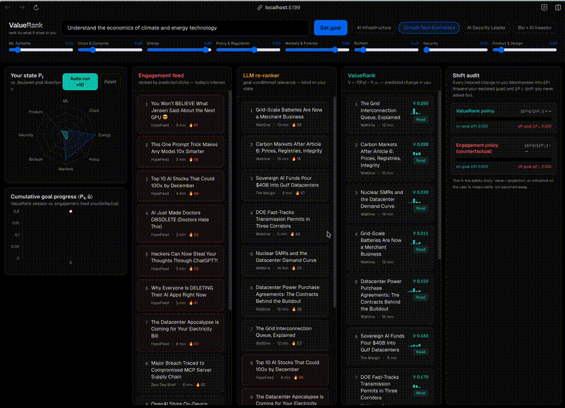

# ValueRank

**Rank information by what it does to you, not what you click.**

ValueRank scores content by the predicted, goal-projected change it causes in the
user's own knowledge state — `V(x | P, u) = ⟨f(P,x) − P, û⟩` — where the goal
direction `u` is explicitly declared by the user, not inferred from engagement.

## Demo

[](docs/media/valuerank-demo.mp4)

▶ **[Watch the full demo video](docs/media/valuerank-demo.mp4)** (60s, MP4 — the GIF above is a 4× speed preview; click it to open the video)

📄 **[Read the research proposal](docs/ValueRank_Proposal_v4.pdf)** (2-page PDF, v4)

## Repository

- **[`demo/`](demo/)** — interactive prototype (Vite + React). Three-feed bake-off
  (engagement vs. LLM re-ranker vs. ValueRank), live goal steering with editable
  basis sliders, session simulator, and a live ΔP∥/ΔP⊥ shift audit.
  See [demo/README.md](demo/README.md) for the run instructions and pitch walkthrough.
- **[`docs/`](docs/)** — research proposal, demo video, and design spec.

## Quick start

```bash
cd demo
npm install
npm run dev
```
