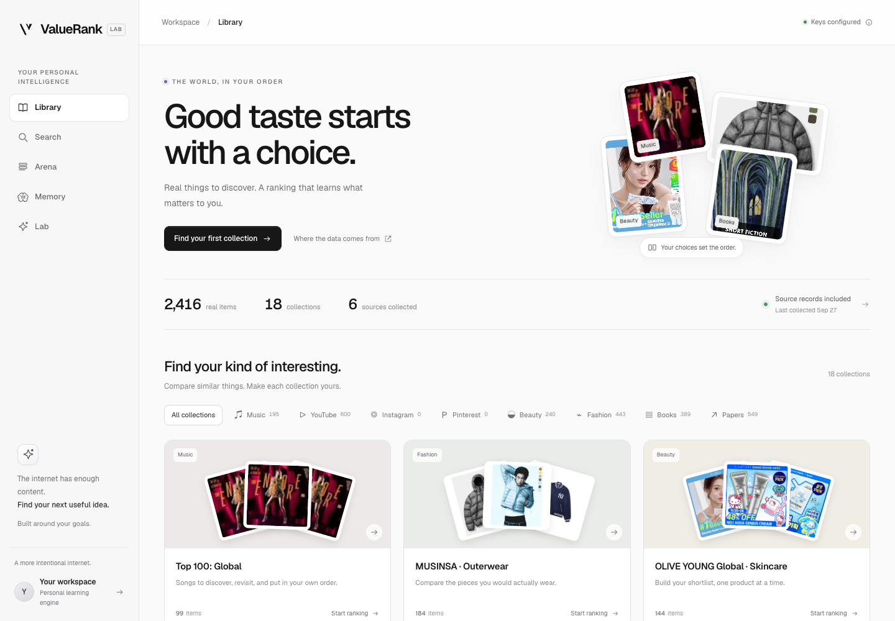

# ValueRank

**Discover real things. Make a choice. Train your personal ranking engine.**

ValueRank combines open web exploration with source-grounded information cards and a
model that learns from your choices. The durable asset is your editable, scoped
knowledge and preferences, plus versioned content, comparisons, and ranking weights.



## Try it locally

Requires Node.js 24+.

```bash
cd demo
npm ci
cp .env.example .env.local
# Add AI_GATEWAY_API_KEY and OPENROUTER_API_KEY locally.
npm run dev
```

Open **http://127.0.0.1:5188**. Credentials stay on the server. Databases, keys,
uploaded images, and private evaluation records are ignored by Git.

## Four connected experiences

**Library.** Browse **27,060 real browser-collected items in 211 collections**:
music, YouTube videos, fashion, beauty, classic books, papers, Netflix movies,
series, animation, Instagram accounts, Pinterest references, and source-labeled
performer photographs. Compare similar items,
give feedback, and see the collection reordered by your learned category model.
Every item carries its source URL, collection page and observation time. The library
and its local metadata ranker work without API keys. OLIVE YOUNG observations come
from its Global storefront (USD); Netflix pages are public catalog snapshots and
do not guarantee regional playback. See [coverage, evidence and limits](docs/prototype/CATALOG.md).

**Search.** Enter a real query, answer optional clarification questions, and explore
original source results, independently readable information cards, or a generated
answer. Every card links its supporting source passages. Jev evaluates relevance,
novelty, and actionability; your learned ranking head changes the order. Compare two
cards, record something you already know, or ask a follow-up. Search sessions have
addressable links and survive refreshes.

**Arena.** Choose between images or content to build a preference dataset. The
included **Interface instincts** pack contains 36 original interface studies with
known design parameters. Import images for actual vision-based feature extraction,
or import JSON/CSV content. Learn mode selects informative pairs; tournament mode
eliminates items only through actual choices. Blind tests reserve separate entities,
lock predictions before the answer, and keep evaluation answers out of training.

**Memory.** Inspect and correct scoped knowledge, preferences, and values. See
actual model weights and comparison history. Undo rebuilds the affected model;
deleting a collection removes its learning records and rebuilds remaining models.
Export versioned sources, items, observations, comparisons, predictions, feature
vectors, weights, training rows, and uploaded assets.

## How the learning works

The local personal model is a regularized pairwise logistic ranker:

`P(A preferred to B) = sigmoid(prior(A) - prior(B) + w · (features(A) - features(B)))`

A real explicit choice updates the weights `w`. Different domains and feature
schemas have separate heads. A tie is a soft equal label; neither and skip are
recorded without inventing directional preferences. Clicks and saves are weak
observations, not automatic negative/positive training labels.

The LLM handles clarification, grounded synthesis, and vision observations. Jev
handles fast typed textual judgments. The personal head learns your choices.
**Hosted Jev is not fine-tuned**, and **Jev does not receive images**. Image imports
use a vision model to produce a fixed set of fallible visual attributes. Those are
not identity recognition or a substitute for a dedicated visual embedding model.

A ranking utility score is not a calibrated probability of truth. Pairwise choice
probabilities require personal held-out evaluation; the app reports sample counts,
accuracy, log loss, and Brier score rather than an invented “understands you” meter.

## The throughput lab

**Lab → Signal Lab** retains the real Jev bulk demonstration: 48 prepared editorial
briefs, 144 typed forecasts, six workers, **2.197 seconds** in the recorded run.
Replay shows actual saved completion timestamps without additional model calls.
That measurement does not include fresh web search or LLM content generation.
The original reading queue, source harness, and provider traces remain available.

## Implementation and evidence

- [Personal-engine implementation and limits](docs/prototype/PERSONAL-INTELLIGENCE.md)
- [Browser-collected catalog and ranking loop](docs/prototype/CATALOG.md)
- [Approved implementation plan](docs/prototype/PERSONAL-INTELLIGENCE-PLAN.md)
- [Configuration and operation](demo/README.md)
- [Jev contract and official references](docs/prototype/JEV.md)
- [Signal Lab measurements](docs/prototype/SIGNAL-LAB.md)
- [Original proposal](docs/ValueRank_Proposal_v4.pdf)

```bash
cd demo
npm test
npm run lint
npm run build
```

This is a single-user local prototype: React, Vite, Node, SQLite, AI SDK, Gateway,
and the TypeSafe SDK through OpenRouter. It binds to loopback. Hosted accounts,
tenant isolation, and durable remote workers are subsequent deployment work.
