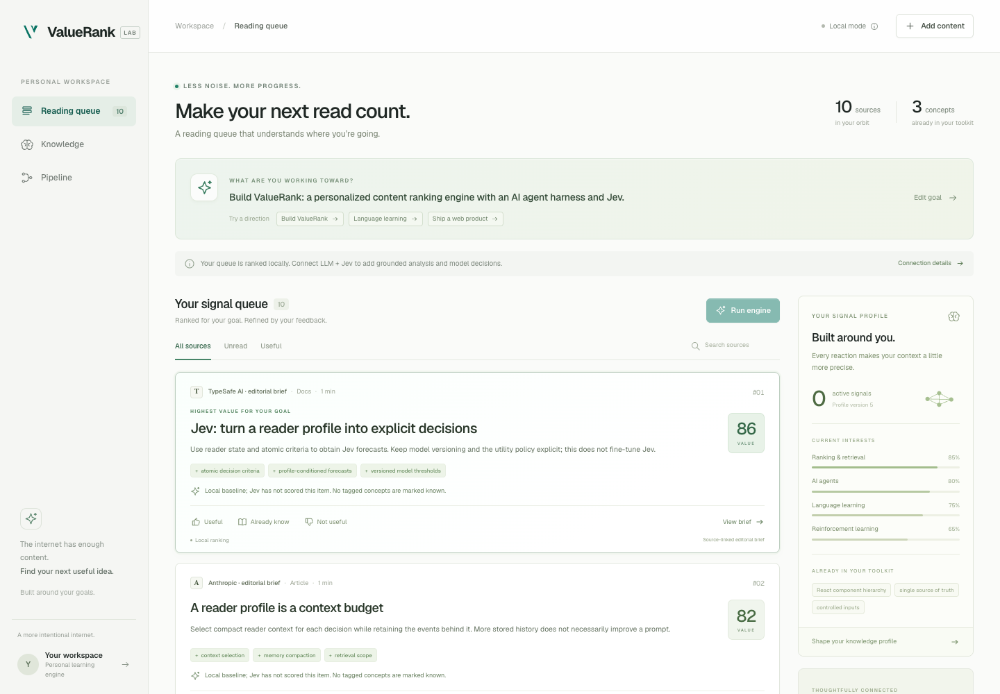

# ValueRank

**A personal reading engine that learns what is worth your time.**

ValueRank turns source text into grounded reading notes, asks Jev bounded questions
about relevance, novelty, and actionability, then ranks the results against your
explicit goal, recorded knowledge, and feedback.

The new prototype replaces the earlier browser-only simulation. The original
proposal and historical demo remain in Git history and `docs/` for reference.



## Run it

Requires **Node.js 24+**.

```bash
cd demo
npm ci
cp .env.example .env.local
# Set AI_GATEWAY_API_KEY and OPENROUTER_API_KEY in .env.local.
npm run dev
```

Open **http://127.0.0.1:5188**. The API runs on loopback port 8787.

Keys remain server-side. `.env.local`, the personal SQLite database, and local QA
artifacts are ignored by Git. Credentials are reread when an engine run starts;
adding them does not require a server restart.

## A two-minute demo

1. Choose a goal and inspect the source-linked starter reading queue.
2. Add a public article URL or paste your own passage.
3. Click **Run engine**. The pipeline shows actual LLM tools, quotation checks,
   Jev calls, durations, and token counts.
4. Open a reading brief to see its evidence, new/known concepts, and score factors.
5. Mark an item **Already know** or **Useful**. Watch the ordering and profile change.
   Click the selected verdict again to undo it.
6. Export the feedback as JSONL, with immutable observations and retraction history.

### What is real

- A bounded Vercel AI SDK `ToolLoopAgent`, with a scoped read-only source tool,
  typed output, exact source-quote validation, time limits, and limited retries.
- The official TypeSafe SDK calling real Jev through OpenRouter (`typesafe/jev-1.13`)
  or directly through TypeSafe (`jev-1.13.0`), with three explicit Noul questions
  and runtime response validation. An OpenRouter key requires no TypeSafe account.
- A deterministic personal ranking policy and feedback-driven topic weights.
- SQLite persistence across page reloads and server restarts.
- Public-URL text extraction with size, time, redirect, and private-network guards.

### What the prototype does not claim

The starter sources are **original editorial briefs** with primary-source links,
not full scraped pages or precomputed live model answers. They are labeled in the
interface. Add a URL or paste text to analyze an actual source passage.

Before keys are configured, a labeled local ranking policy works without inference.
Missing, failed, or outdated Jev judgments are never presented as current model
results. A changed profile invalidates old Jev forecasts until the engine is rerun.

The 0–100 score is **heuristic utility, not a calibrated probability of learning**.
Jev's outputs are model forecasts about named predicates. The app does not fine-tune
Jev or claim to reproduce its RLCD training. “Useful” changes preferences; only
explicit “Already know” feedback adds specific concepts to recorded knowledge.

## Implementation and verification

- [`demo/README.md`](demo/README.md) — configuration and operational scope
- [`docs/prototype/ARCHITECTURE.md`](docs/prototype/ARCHITECTURE.md) — data flow and design decisions
- [`docs/prototype/JEV.md`](docs/prototype/JEV.md) — verified API contract and sources
- [`docs/ValueRank_Proposal_v4.pdf`](docs/ValueRank_Proposal_v4.pdf) — original research proposal

```bash
cd demo
npm test
npm run lint
npm run build
```

This is a **single-user local prototype**. It binds to loopback and has no shared
account system. A public deployment needs authentication, tenant isolation,
a durable job worker, and an appropriate hosted database before exposing personal
data or paid API calls.
