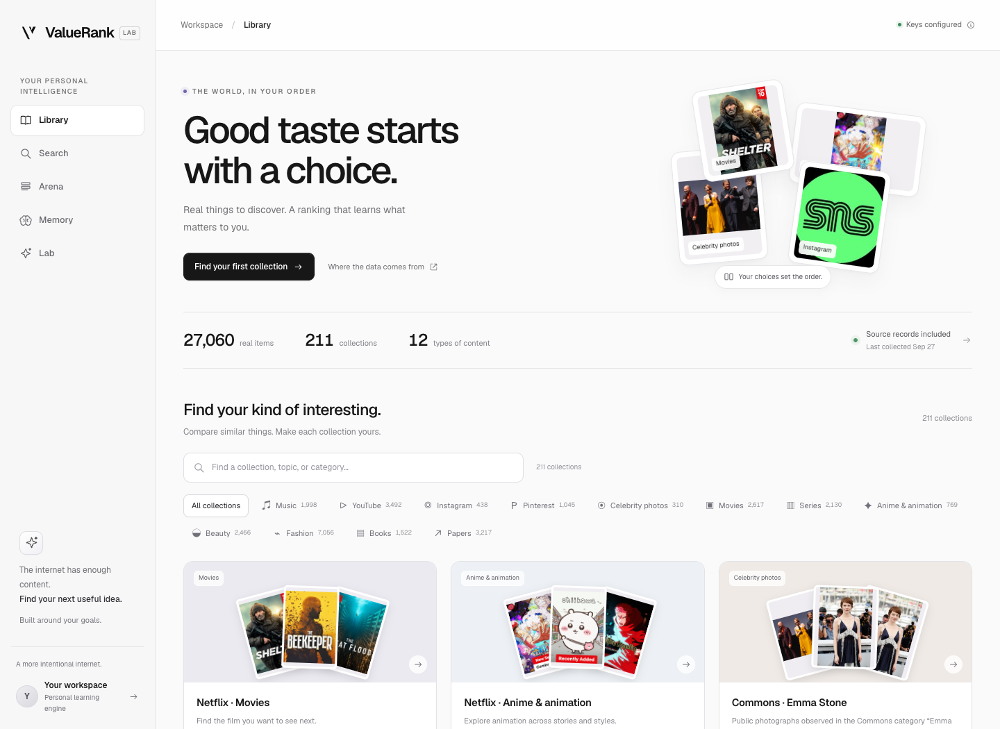
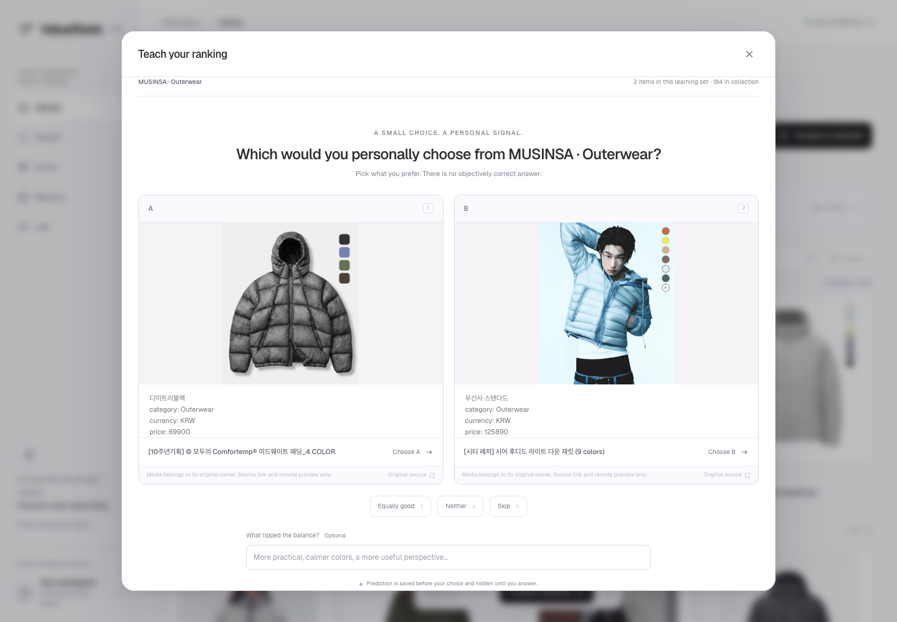

# Real-web ranking catalog

ValueRank now starts with a browsable **Library** of real candidates, so a user can
compare similar things and improve a personal order without running a new web search.
The expanded browser snapshots captured on **2026-09-27** contain **27,060 unique
items in 211 collections across 12 populated kinds**: **11.20×** the original 2,416
items. These are bounded, dated observations rather than complete platform copies.



## What was collected

| Domain | Source | Unique items | Comparable collections |
| --- | --- | ---: | --- |
| Music | Apple Music | 1,998 | 32 regional/global charts |
| Videos | YouTube | 3,492 | 16 channels across technology, science, culture, cooking and learning |
| Fashion | MUSINSA | 7,056 | 10 groups including tops, bags, hats, accessories, dresses and shoes |
| Beauty | OLIVE YOUNG Global | 2,466 | 8 groups including hair, masks, sun care and tools |
| Books | Standard Ebooks | 1,522 | Full captured edition shelf and 19 source-labeled genres |
| Papers | arXiv | 3,217 | 7 keyword discovery cohorts |
| Movies | Netflix | 2,617 | 25 captured-kind/genre groups |
| Series | Netflix | 2,130 | 22 captured-kind/genre groups |
| Anime/animation | Netflix | 769 | 8 groups, including Western animation and cartoons |
| Performer photos | Wikimedia Commons | 310 | 26 source category/performer groups; photos, not distinct people |
| Instagram accounts | Instagram | 438 | 21 focused discovery groups plus an all-accounts shelf |
| Visual references | Pinterest | 1,045 | 14 query groups plus an all-pins shelf |
| **Total** | **12 populated catalog kinds** | **27,060** | **211 collections** |

Overlapping charts, subjects and search cohorts share one item record. Collection
membership counts therefore exceed unique item counts. arXiv groups are keyword
search cohorts, not expert quality labels. The books are mainly classic public-domain
editions, not a modern technical-book catalog. OLIVE YOUNG **Global has USD pricing**;
MUSINSA has KRW pricing. Global is a different storefront from OLIVE YOUNG Korea.

Instagram and Pinterest were collected after the user signed in through Chrome.
Only public search cards were retained: 438 account records and 1,045 pins. The
account results include creator, brand and fan pages; a visible verification badge
is recorded as an observation rather than an independent identity guarantee.
Pinterest may contain photos, illustrations or generated imagery, and its titles or
alt text may be machine-written. No private feed, message, cookie or credential is
in the catalog.

The arXiv expansion stopped when a page displayed `Rate exceeded.` Its source is
marked **partial**. OLIVE YOUNG Korea and Open Library remain blocked by their
human-verification screens. No alternate endpoint or identity was used to bypass a
barrier. Source statuses distinguish bounded partial captures from blocked attempts.

Netflix title IDs are deduplicated across movies, series and animation. These public
catalog pages do not certify regional streaming availability. Animation membership
comes from observed anime/animation/cartoon genre pages; other movie/series grouping
uses observed row labels. Performer photos retain their actual Commons file page,
photographer/author and file-specific license. Several photos can depict one person;
there is no face recognition, biometric encoding or inferred demographic labeling.

Capture evidence and reproduction details:

- [Music, YouTube, Instagram and Pinterest](catalog-culture-notes.md)
- [MUSINSA and OLIVE YOUNG](catalog-shopping-notes.md)
- [Books and papers](catalog-editorial-notes.md)
- [Expanded lifestyle collection](catalog-expansion-lifestyle.md)
- [Expanded books and research](catalog-expansion-editorial.md)
- [Netflix and performer photographs](catalog-expansion-screen.md)
- [Signed-in public Instagram and Pinterest collection](catalog-expansion-social.md)

The normalized batches, DOM extraction scripts, raw observations and browser
snapshots live in [`demo/catalog-crawl`](../../demo/catalog-crawl). All retained
items have `extraction: browser-dom`. ValueRank copies observed source fields rather
than generating catalog titles, prices, creators or links. A source can itself host
generated imagery or machine-written labels; browser provenance does not certify
that content as human-authored. No paid model calls were used for this collection.

## The ranking loop

1. Browse a collection, inspect an item and follow its original link. Filter by
   title, creator, brand or other observed metadata.
2. Click **Teach your ranking**, or select two or more specific items and compare
   that selection. Large collections use a bounded learning set of at most 200;
   selecting items explicitly can train on other parts of the collection.
3. A comparison records the displayed item versions, prediction and actual choice.
   Choosing A, B or a tie updates the category's local pairwise ranking head.
   Neither/skip records no invented directional label.
4. The whole collection is rescored immediately, including candidates outside the
   learning set. Return to the ranking to see changes. Undo rebuilds the head from
   the remaining choices. Memory contains the same comparison history and exports.



Additional verified views: [collection grid](catalog-collection.png) and
[390-pixel mobile layout](catalog-mobile.png).

Before personal labels exist, the UI displays collection encounter order. This is
not necessarily the original website's exact chart position after cross-collection
deduplication; observed chart positions are preserved separately in item attributes.
Source popularity is never treated as a personal preference label.

The current catalog encoder is a **56-feature metadata baseline**: 48 lexical hash
features plus presence/value pairs for price, year, duration and rating where those
fields exist. A separate head is maintained for each item kind and feature schema.
Music choices do not train the fashion head. Ranking scores are relative utilities,
not calibrated probabilities or proof that the model understands someone's taste.

Thumbnails make comparison possible, but **catalog image pixels, audio and video
have not been encoded**. The system cannot yet infer visual or musical taste from
these metadata alone. The existing Search experience uses LLM + Jev, and Arena has
an explicit vision-import pipeline; the new catalog does not silently run either
over thousands of items. Hosted Jev weights are not fine-tuned. A future enrichment
pass should create a new versioned feature schema and retain these observations and
labels, then evaluate the improvement on separately withheld items.

Catalog datasets are learning-only. Items have already been browsable; pretending
they were an unseen test set would inflate an evaluation. The existing Arena blind
test mechanism remains available for separately partitioned imports.

## Storage and reproducibility

The public candidate database is `.data/catalog.sqlite`, separate from private
`.data/personal.sqlite`. Node's built-in SQLite stores sources, collections, item
identities, immutable content versions, memberships and import runs. Provider ID
(or canonical URL) determines identity. Exact batch replay is idempotent. New
observations update `lastSeenAt`; content changes create a revision. Older captures
cannot overwrite newer content. Historical comparison inputs remain unchanged.

The app imports the 22 explicitly listed recorded batches at startup, without opening a browser or
calling an AI provider. Recollecting the web is an explicit operation using the
documented browser scripts; there is no recurring crawl or background inference.

```sh
cd demo
npm run catalog:import                         # Import bundled observations
npm run catalog:import -- /path/new-batch.json  # Validate and upsert one source batch
npm run catalog:stats
npm run catalog:export -- /tmp/valuerank-catalog.json
```

`VALUERANK_CATALOG_DB_PATH` selects another database; `:memory:` is useful in tests.
`VALUERANK_SKIP_CATALOG_SEEDS=1` suppresses bundled imports on server startup.
Deleting private learning data does not delete the separate public catalog.

HTTP endpoints on the existing loopback-only API:

- `GET /api/catalog`: source status, exact unique counts and collections.
- `GET /api/catalog/collections/:id`: paginated items; `query`, `sort=personal|source|recent`,
  `offset` and `limit` (at most 60).
- `POST /api/catalog/collections/:id/practice`: create/reuse a learning set and pair;
  optional `itemIds` selects 2–200 members of that collection.
- `GET /api/catalog/export`: download the current public metadata snapshot. Personal
  observations and training records use the separate Memory export.

Every item retains its original URL, listing URL, browser observation timestamp and
available thumbnail URL. Media binaries are not downloaded or rehosted. Remote
thumbnails may expire or stop loading. Prices, availability and popularity are
dated observations, not current checkout quotes. Full books, articles, papers,
audio and video are not copied into this database.

SQLite is sufficient for this local snapshot and avoids an external dependency.
Moving to a shared Supabase deployment later requires account isolation for private
choices, separate public-catalog tables, storage migration, and incremental crawl
workers. It is not necessary to connect Supabase to try this version.

## Verification

The current implementation passes **308 automated tests**, lint and the production
build. The expanded browser flow is recorded in
[`catalog-expansion-ui-verification.json`](catalog-expansion-ui-verification.json):
selection, feedback, model update, reranking and undo were exercised in a separate
temporary preference database. Undo restored the original visible item order and
scores. Desktop and 390-pixel mobile layouts were checked.

Catalog tests exercise batch validation, transaction rollback, duplicate membership,
idempotency, immutable revisions, stale captures, durable reopening, blocked-source
integrity, neutral cold start, a real choice changing ranking, undo and category
isolation. The original 18-collection flow verification is retained in
`catalog-verification.json`. The expanded snapshot has a separate reproducible
`catalog-expansion-verification.json` audit: production schema validation, per-batch
and global identity uniqueness, valid memberships, exact replay, durable database
reopening, zero Netflix title duplication across kinds, and exact social URL/image/
timestamp matches against saved browser evidence. It uses a temporary
on-disk database and does not access the user's catalog or preference store.

```sh
cd demo
node --import tsx catalog-crawl/expansion/audit.mjs
```

Collection counts count memberships; the headline item total counts unique provider
identities after original and expanded observations are merged. Reported thumbnail
counts mean a source URL was observed, not that remote delivery will work forever.
Test choices never enter the user's private database.
