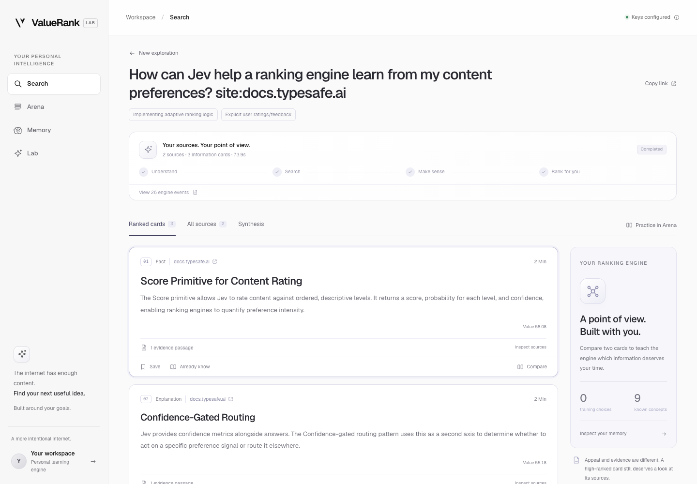
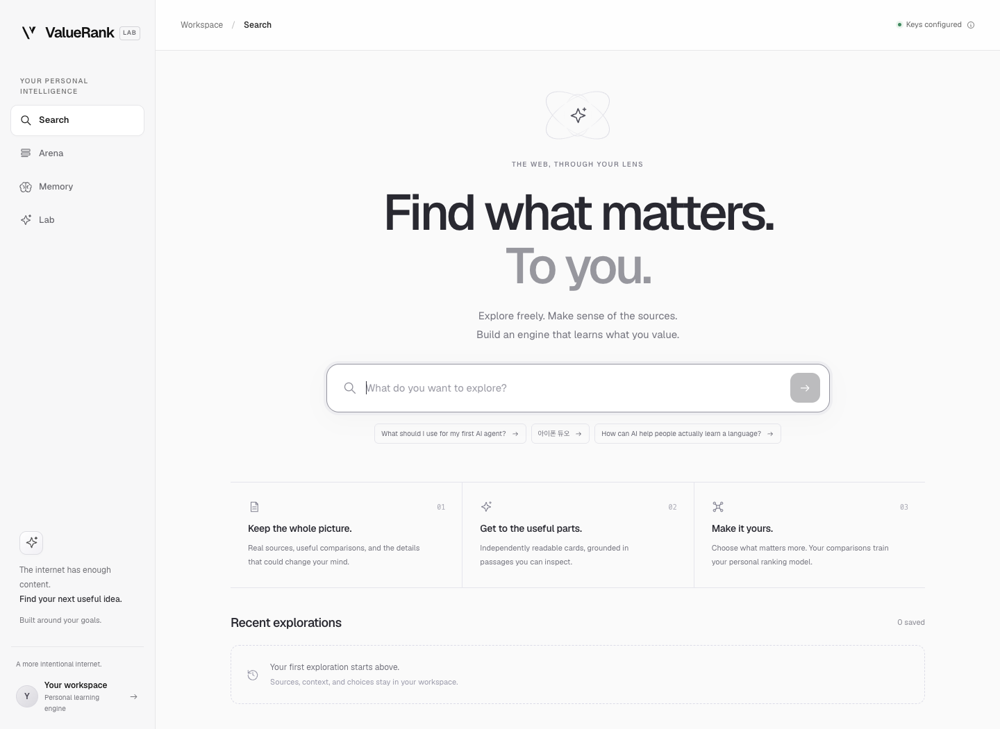
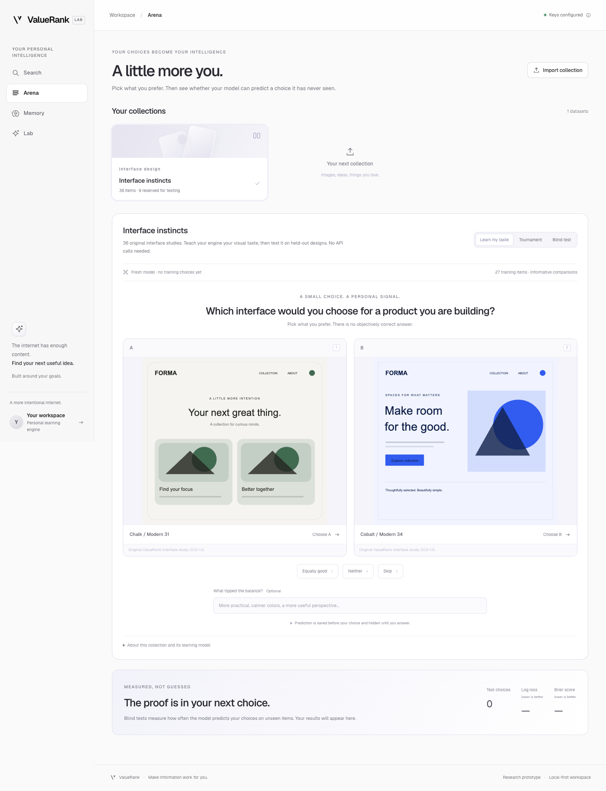

# Personal search and preference learning

Implementation notes, 26 September 2026. The application runs locally in `demo/`.

## Search

A query is saved before inference starts. Gateway Exa discovery supplies real URLs
and bounded excerpts; an LLM asks two or three optional questions. Literal public
URLs instead use bounded page extraction (up to three URLs, 12,000 characters each),
with no LLM retrieval or search call. These saved pages are reused after clarification.
The next step
retrieves more sources and makes independent fact, explanation, comparison,
tradeoff, and method cards. Each quote must occur in a registered source revision.
New generations select IDs from a bounded catalog of contiguous source passages;
the server resolves those IDs to the original text instead of asking the model to
transcribe quotations. Unknown IDs and mismatched source IDs are rejected.
Sources remain browsable in their retrieved order. Matching a quote establishes
provenance, not factual correctness or semantic entailment.

Jev asks three explicit text predicates for each card. The personal model adds a
learned feature adjustment to the prior. Knowledge feedback lowers familiar units.
Generated answers use stable unit/version references, so later reranking cannot
silently change which card a citation means. A follow-up can rescore existing cards
or request a bounded second research round.

The implementation accepts at most 16 distinct source snapshots and 24 cards per
session, with two research rounds, two concurrent synthesis batches, and four
concurrent Jev evaluations. Search requests ask for 4 discovery or 8 research
results. Gateway executes its search tool server-side: local result limits do not
constitute a hard provider billing cap. Provider failures remain visible and no
fixture replaces a missing search or model response.

Jobs checkpoint sources, accepted cards, stages, and reported usage. Cancellation
preserves completed work. A server restart marks an interrupted operation instead
of silently replaying paid requests. Human answers do not hold a model request open.
Initial search is materially slower than the prepared-brief throughput benchmark.

## Personal model and data

Separate SQLite entity tables hold immutable source/unit revisions, feature vectors,
datasets and partitions, exposures, pre-answer predictions, comparisons, profile
facts, observations, and model versions. Each observation retains its context.

The model minimizes average pairwise logistic loss plus L2 regularization. It is
refitted deterministically from active explicit comparisons; sparse histories get
stronger regularization. Prior scores and feature vectors are captured in the
training rows, not silently replaced by newer source/model results.

Directional choices use targets 1 or 0; ties use 0.5. Neither and skip do not produce
a directional label. Dwell, save, and open observations do not train this version.
Undo rebuilds from remaining labels. Deletion removes affected raw data and old
model versions, then rebuilds from remaining valid training data.

Heads are separated by domain and feature schema. Search features include Jev
judgments, editorial attributes, and coarse topic labels. These are a small v1
representation, not a universal user embedding. Stated content values inform new
search context; the model does not infer unrelated tastes from portrait choices.

## Arena and images

The starter pack contains 36 original SVG interface studies (CC0). Design parameters
are known from authoring and labeled accordingly; they are not pretend vision or
Jev outputs. Uploaded PNG/JPEG images take a separate actual vision path through
Gateway. The browser resizes files, the server validates raster headers and limits,
and the model extracts a fixed 16-attribute vector from pixels. Cache identity
includes image bytes, feature schema, and requested encoder model. The resized
uploaded raster, model output, token count, and encoding attempt are retained locally.
Browser uploads are resized to at most 640 pixels and JPEG-encoded; original files
are not preserved by that browser flow.

These visual attributes are intentionally limited and can miss details essential
to face or aesthetic preferences. A dedicated visual embedding encoder is a future
experiment. Neither identity recognition nor sensitive personal-trait inference is
part of this implementation. Source and rights metadata remain inspectable.

JSON/CSV imports accept standalone text with optional source and entity metadata.
Without supplied features, they use an explicitly labeled local 48-dimensional
lexical hashing baseline. They do not claim to have received semantic Jev analysis.
Advanced imports may provide versioned features and source records.

Learning mode combines uncertainty, feature distance, coverage, and random
exploration. Display side is randomized. Tournaments record only the comparisons
made, never imagined wins against unseen opponents.

Evaluation partitions group supplied entity IDs (or conservative source/content
identities). Entities already exposed for training are excluded from blind tests,
and entities exposed in blind tests are excluded from later training across datasets.
Search collections already displayed to the user are learning-only. Small collections
with fewer than four distinct entities are also learning-only. Test labels never
enter training rows, including after undo, reload, or model rebuild. Predictions
are persisted before exposure and withheld from prompt/export until answered.

Reported evaluation includes the number of directional choices, correct predictions,
baseline correct predictions, log loss, and Brier score. Synthetic regression tests
establish implementation behavior; they do not establish this user's preference
accuracy. Real personal accuracy starts at zero observations until the user chooses.

## Storage and operations

- `.data/personal.sqlite`: personal search and learning ledger.
- `.data/personal-media.sqlite`: uploaded raster assets, cached encodings, import jobs.
- `.data/valuerank.sqlite` and `.data/burst.json`: earlier reading engine and lab.
- Personal API: `/api/personal`; export: `/api/personal/export`.
- Local session URLs: `/#search/<id>` and `/#arena/<dataset-id>`.

All files under `.data/` and `.env.local` are Git-ignored. Export includes personal
source/content records and uploaded images. It is generated on demand, not committed.
Completed original design assets are public repository files; no user uploads are.

## Browser verification

Final automated validation passed: **285 tests across 17 files**, lint, TypeScript,
and the production build. See [sanitized live verification](personal-live-verification.json)
for model calls and source/citation checks.

The final fresh web flow completed in 73,889 ms of processing time: two clarification
questions answered in the UI, two distinct retrieved sources, three real Jev-scored
cards, and a cited answer. All three evidence passages matched their source text;
both answer citations resolved to the correct saved card versions. Gateway reported
10 search tool results and 146,614 LLM tokens across the flow, despite the prompt
asking for one search per phase. Provider-managed search can exceed the requested
call count; this prototype reports it but does not impose a hard billing cap.

A separate failed explicit-URL session resumed from saved source text with the final
model setting and completed in 20,937 ms without another retrieval. Its earlier
failed attempts remain included in cumulative usage. These are individual runs,
not latency guarantees.

Browser checks used an isolated database on port 8791 for preference mutations.
An A/B choice created a model update, undo rebuilt the model without that label,
and a blind-test answer stayed outside training. Tie, neither, and skip paths were
also exercised. Memory facts could be added, edited, and removed. An eight-row CSV
import produced a persistent collection and real comparison prompt.

Desktop and 390-pixel mobile layouts were checked; the mobile Arena and Memory
pages had no horizontal overflow. The browser reported no uncaught errors. The
main workspace retained zero synthetic training or test choices.
The real search result was also turned into an Arena collection and its first
comparison opened, without answering on the user's behalf.

These screenshots show the isolated test workspace before preference answers:

The actual Gateway vision encoder was separately tested on an original interface
PNG. The final default, Qwen 3.8 Flash, returned 16 visual attributes in 5,005 ms
with 1,743 reported tokens. An earlier MiMo run returned 16 attributes in 11,023 ms
with 1,218 tokens. These were real pixel-input requests. Full media-storage and preference-model integration is covered
by an isolated test with a mocked encoder; no real multi-image paid import was
used to manufacture user preferences.

The final default is `alibaba/qwen3.8-flash` through Gateway, with reasoning off
requested for these routine steps. The successful resumed generation reported zero
reasoning tokens. Earlier MiMo and Qwen-with-default-reasoning attempts hit the
90-second deadline; those failures and cumulative usage remain in the local trace.
Changing the model is explicit configuration, not hidden automatic fallback.

## Primary references

- [Gateway web search](https://vercel.com/docs/ai-gateway/models-and-providers/web-search)
- [Jev inputs and customization](https://docs.typesafe.ai/models)
- [Jev features with downstream supervised learning](https://docs.typesafe.ai/cookbooks/autoresearch_feature_discovery)
- [RankNet: pairwise learning to rank](https://www.microsoft.com/en-us/research/publication/learning-to-rank-using-gradient-descent/)
- [Learning to rank from biased implicit feedback](https://www.microsoft.com/en-us/research/publication/unbiased-learning-rank-biased-feedback/)
- [Active preference learning](https://arxiv.org/abs/2405.03059)
