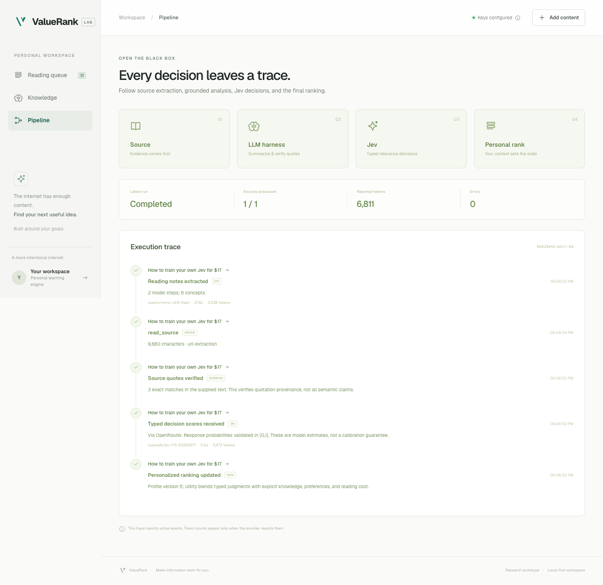

# Prototype verification — 26 September 2026

## What was checked

| Boundary | Evidence |
|---|---|
| TypeScript and production frontend | `npm run build` passes |
| Static checks | `npm run lint` passes |
| Automated behavior | 195 tests across 9 files pass |
| Dependency audit | 0 known vulnerabilities after compatible patches |
| Browser / API / database | Live UI loaded from port 5188 and received persisted state from port 8787 |
| Real URL extraction | Requested Vercel Jev article imported: 9,130 characters, correct title, `url-extraction` provenance |
| Knowledge feedback | Jev editorial item moved from rank 1 to rank 9 after Already know; undo restored its prior order |
| Goal steering | Web-product goal promoted the Next.js server-boundary reading |
| Reader | Source link, exact quote, concept novelty, and score breakdown inspected in browser |
| Familiar-content compression | All-known React concepts collapse the card to a short review note |
| Input errors | Private/custom-port URL rejected; error displayed inside Add Content dialog |
| Mobile | 390 × 844 viewport, document width 390; no horizontal overflow |
| Browser runtime | No browser errors reported during inspected interactions |
| Secret boundaries | `.env.local`, `.data/`, and `.e2e/` ignored by Git; API exposes key-presence booleans only |
| Restart persistence | Successful live analysis, Jev decision, and completed trace survived a server restart |

## Automated test scope

- Ranking, goals, known concepts, preferences, score bounds, ties, stale Jev forecasts.
- Real in-memory SQLite transactions, idempotence, replacement/undo, immutable history,
  knowledge overrides, export, and source deduplication.
- Actual TypeSafe SDK serialization with a mocked transport for both direct and
  OpenRouter routes: auth, retries, response schema, model pins/snapshots,
  cancellation, deadlines, and bounded context.
- Provider-specific key/model selection; no TypeSafe key sent to OpenRouter.
- Real AI SDK orchestration with a mock language model: source-tool call separated
  from JSON synthesis, aggregate token usage, one total deadline, required-tool
  enforcement, MiMo JSON-mode validation, one bounded repair for malformed JSON or
  schema failures, failed-generation usage accounting, and rejection of invented quotes.
- Static provider-error messages for authentication, billing, model access,
  rate limits, timeouts, tool-choice violations, and invalid output.
- Private/reserved IP and URL boundary cases, exact-source quotation and schema checks.
- Pipeline serialization, eight-item limit, cache reuse, traces, sanitized errors,
  partial failures, and mid-run profile changes.

## Live inference status

**Verified with real providers on 26 September 2026.** A Vercel Jev article was
processed end to end through the running application API, using the user-supplied
Gateway and OpenRouter credentials. No mock response was used in this run.

| Stage | Observed result |
|---|---|
| Source | `https://vercel.com/i/what-is-jev`, 9,130 extracted characters |
| LLM | Gateway `xiaomi/mimo-v2.6-flash`, 2 model calls, 12.304 seconds, 2,664 reported tokens |
| Grounding | 6 concepts; 3 quotes matched the supplied source |
| Jev | OpenRouter `typesafe/jev-1.13-20260917`, 469 ms, 2,863 reported tokens |
| Predicates | Relevance 0.48, novelty 0.98, actionability 0.51 |
| Result | Completed 1/1 with zero errors; heuristic score 66.402 saved for profile v5 |

The observed probabilities and durations are a single-run result, not an accuracy
or latency benchmark. Quote matching verifies provenance rather than semantic
correctness. See [sanitized live metadata](live-verification.json).

Live testing found two integration problems that unit transport mocks did not:
the initial GPT-6 Luna model was denied by this Gateway account's free-tier policy,
and MiMo required separate tool selection plus JSON mode with a fully specified
schema in the trusted prompt. The default model and harness now reflect the
working configuration; Zod and exact-source evidence checks remain mandatory.

A subsequent Together article exposed malformed JSON from MiMo: an SDK
`NoObjectGeneratedError` with `finishReason: stop`, followed by a JSON parse error.
It was rejected without a Jev call or accepted notes. The harness now gives shorter
output targets and permits one bounded format repair for JSON parsing or schema
failures, without relaxing schema or evidence requirements. Invalid output may
still fail and require an explicit retry.

The Together article was then processed successfully through the browser's
**Analyze this source** action. This successful run did not require a format repair;
repair behavior is separately verified with mocked SDK responses.

| Stage | Observed result |
|---|---|
| Source | `https://www.together.ai/blog/how-to-train-your-own-jev`, 9,680 extracted characters |
| LLM | Gateway `xiaomi/mimo-v2.6-flash`, 2 model calls, 21.627 seconds, 3,338 reported tokens |
| Grounding | 6 concepts; 3 quotes matched the supplied source |
| Jev | OpenRouter `typesafe/jev-1.13-20260917`, 479 ms, 3,473 reported tokens |
| Predicates | Relevance 0.39, novelty 0.98, actionability 0.66 |
| Result | Completed 1/1 with zero errors; heuristic score 57.912 saved for profile v5 |

SDK, pipeline, and orchestration unit tests still use explicit mocked transports
or mock language models. The independent live result above is recorded separately.

The local database contains demo browser-verification events and imported articles.
It is not committed. No personal profile, source body, or API key was uploaded.
